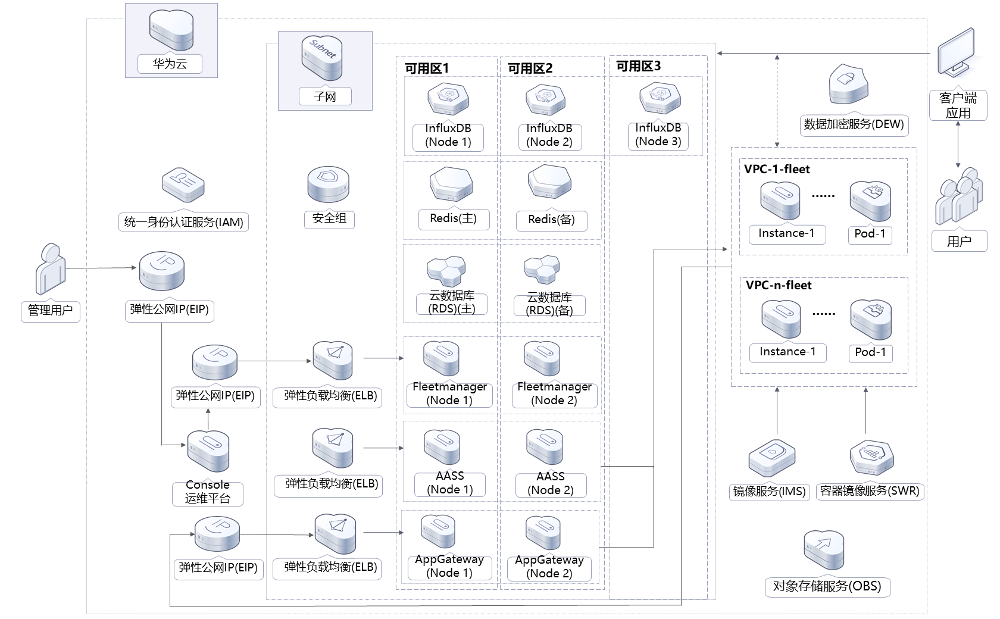
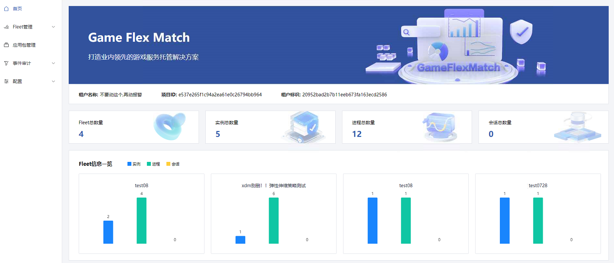
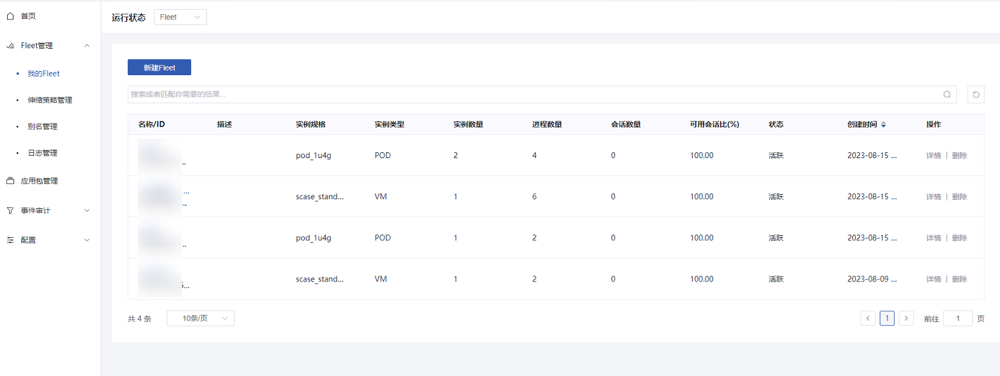
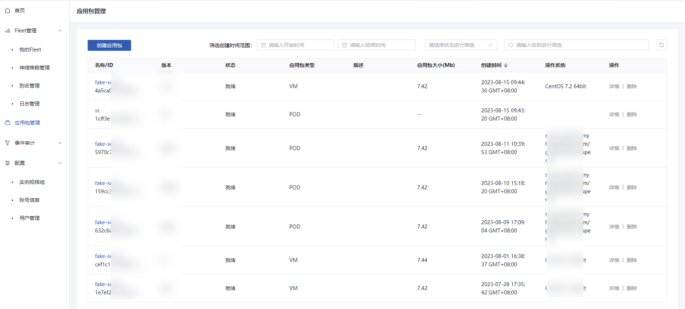
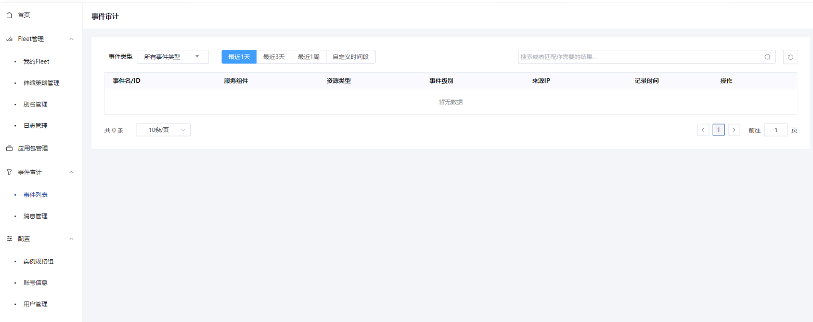
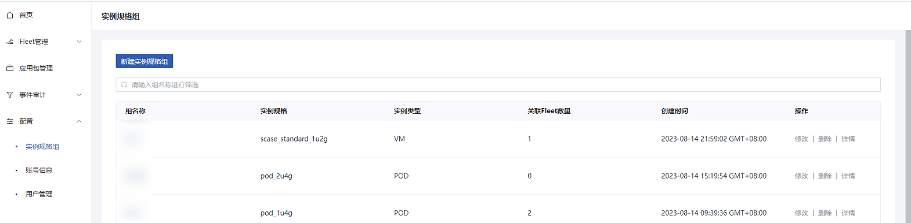

[TOC]

**解决方案介绍**
===============
该解决方案基于华为云开源项目GameFlexMatch构建，可以帮助您在华为云上快速部署游戏服务端应用托管平台。GameFlexMatch支持游戏应用智能托管、服务端资源有状态弹性伸缩、灰度发布以及就近调度等能力，能够帮助您有效降低游戏运维以及云上资源成本。适用于如下游戏场景：

- MOBA
- 射击
- 竞速
- 棋牌类等

解决方案实践详情页面地址：https://www.huaweicloud.com/solution/implementations/game-hosting-platform-based-on-gameflexmatch.html

**架构图**
---------------


**架构描述**
---------------
该解决方案会部署如下资源：
1. 创建九个弹性公网IP EIP，用于提供访问公网和被公网访问的能力；
2. 创建两台弹性云服务器 ECS，分别绑定弹性公网IP，跨可用区部署，用于部署FleetManager组件，负责应用进程的全局化动态部署及管理，支持配置动态部署策略，基于成本或时延优化应用分布，分别绑定两个弹性公网IP，负责弹性伸缩策略的配置和服务端会话、客户端会话与应用包的管理，服务端应用的灰度发布等；
3. 创建两台弹性云服务器 ECS，分别绑定弹性公网IP，跨可用区部署，用于部署AppGateway组件，负责应用进程、会话与客户端连接的管理，通过与AuxProxy通信获得应用进程信息，决策进程资源的调度；
4. 创建两台弹性云服务器 ECS，分别绑定弹性公网IP，跨可用区部署，用于部署AASS组件，负责弹性伸缩组和弹性伸缩策略的管理与执行，以及服务端应用资源的监控，调用华为云AS（弹性伸缩服务）实现资源的弹性伸缩；
5. 创建一台弹性云服务器 ECS，并绑定弹性公网IP，用于部署Console运维平台，监控GameFlexMatch的运行状态，以及运维管理GameFlexMatch的fleet、应用包与用户信息等；
6. 创建三个弹性负载均衡 ELB，其中关联AppGateway及FleetManager组件服务器的两个ELB分别绑定弹性公网IP，用于访问组件的流量跨可用区进行分发；
7. 创建云数据库 RDS for MySQL实例，主备分区部署，具备跨可用区故障容灾的能力；
8. 创建云数据库 GaussDB(for Influx)集群，3AZ架构部署，具备跨可用区故障容灾的能力；
9. 创建分布式缓存服务 Redis版，兼容Redis，为用户提供高性能、低成本NoSQL数据库，同时数据流转过程中数据的一致性；
10. 创建一个对象存储服务 OBS桶，用于存放应用包镜像环境配置脚本、AuxProxy组件压缩包。

此外，您可以自行创建数据加密服务 DEW的账号密钥对，用于弹性伸缩实例 ECS 的密匙验证登录。

**组织结构**
---------------

``` lua
huaweicloud-solution-game-hosting-platform-based-on-gameflexmatch
├── game-hosting-platform-based-on-gameflexmatch.tf.json -- 资源编排模板
├── userdata
    ├── init-backend.sh  -- GameFlexMatch组件服务器配置文件
    ├── init-console.sh  -- GameFlexMatch运维平台服务器配置文件
```

**开始使用**
---------------
详细使用请参考游戏服务托管解决方案部署指南[开始使用章节](https://support.huaweicloud.com/ghpgfm-ctf/ghpgfm_06.html)

1. 打开浏览器，输入该解决方案一键部署后生成的IP地址，登录Console运维平台。账号名：admin，密码为弹性云服务器初始密码。首次登陆后需要重置密码，具体使用请参考GameFlexMatch快速入门。

	图1 账号登录
	
1. 重置密码，再次登录配置租户完成后进入系统首页。首页提供了展示对GameFlexMatch使用租户在某个region下的整体运行情况，包括Fleet、实例、进程与会话的总数量；提供图表化展示每一个Fleet中实例、进程与会话的数量；同时提供了图表化显示每个Fleet中不同状态的实例、进程、会话的数量。

	图2 系统首页
	
1. Fleet管理，应用进程队列(fleet)是一个管理后端服务应用集群的队列，可以支持手动或自动增加后端服务应用的数量，以满足不同的负载需求。该功能模块包含“我的Fleet”、“伸缩策略管理”、“别名管理”及“日志管理”。

	图3 Fleet管理
	
1. 应用包管理。应用镜像内包含AuxProxy服务组件以及已完成对接的后端服务应用，并已完成相关的启动配置，用于弹性扩容虚机的模板。您可以将需要托管的应用包上传至GameFlexMatch平台，自动化生成安装有监测、上报插件的应用包镜像，并用于fleet创建，支持VM和POD两种镜像打包模式。您也可以直接绑定华为云IMS或SWR中已有私有镜像，并快速构建fleet。

	图4 应用包管理
	
1. 事件审计。事件审计可以查看服务运行的活动记录。

	图5 事件审计
	
1. 配置。包含”实例规格组“，“账号信息”及“用户管理”功能。实例规格组：支持预先创建实例规格组模板，在创建fleet提供选择。用户管理：为使用GameFlexMatch用户关联管理华为云租户的模式，通过关联租户对华为云资源进行管理，多个用户可关联至一个租户，一个用户也可以关联多个租户，并支持即时切换。

	图6 配置
	